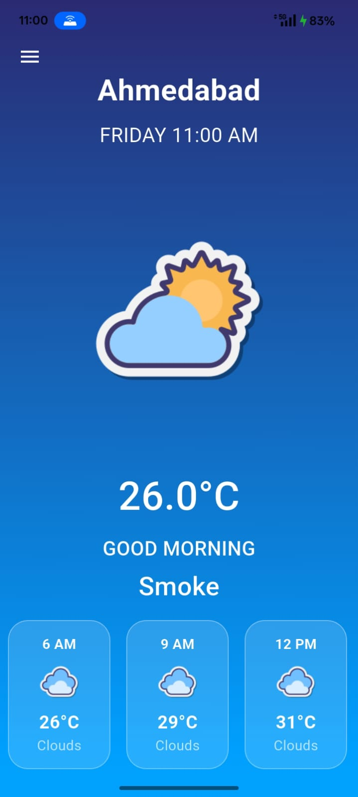
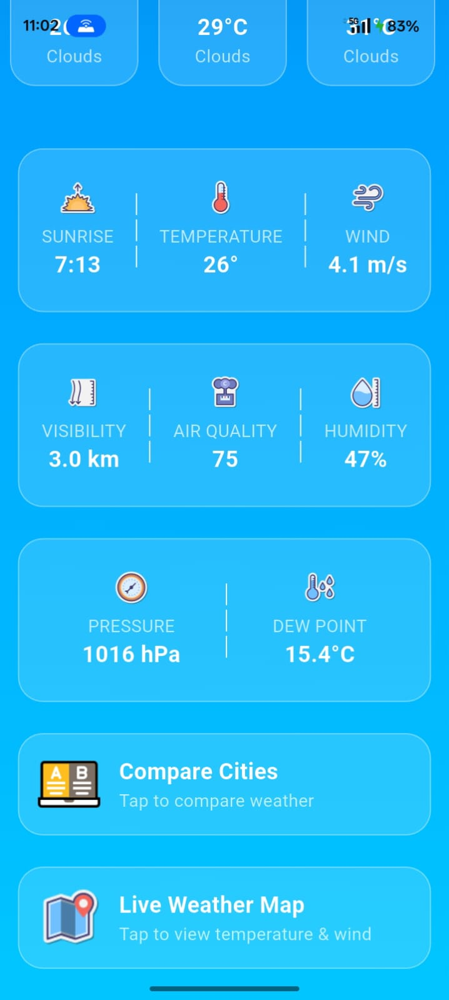
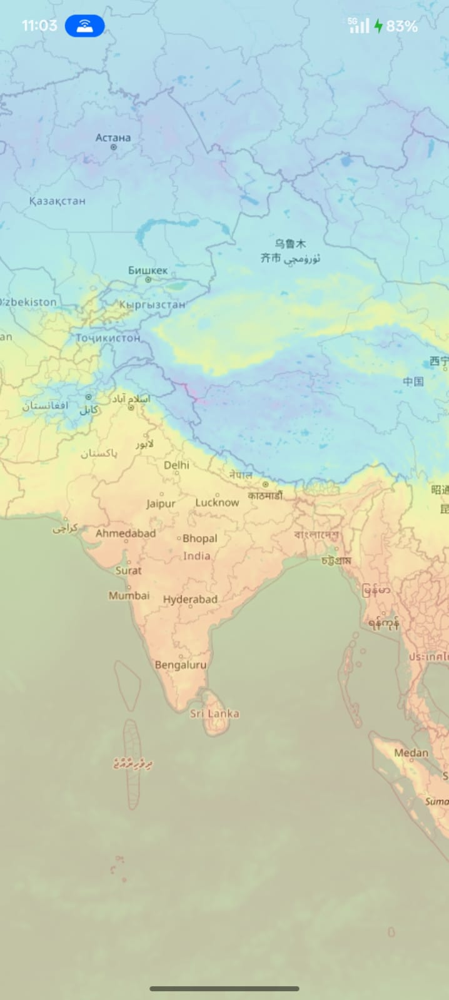
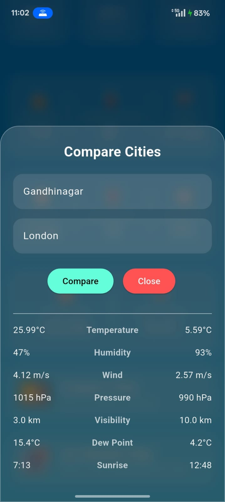

# 🌦 AoctoMeater – Smart Weather Intelligence App

AoctoMeater is a powerful Flutter-based weather application that provides real-time weather updates, air quality monitoring, interactive maps, and multi-city comparison in a clean and modern UI.

---

## 🚀 Live Website

🔗 Website:  
https://jaymeen07-r.github.io/Weather-App/website/

📦 Download Android APK:  
https://github.com/jaymeen07-r/Weather-App/releases/download/Weather_Application/WeatherAPP.apk

---

## 📱 Platform Support

- ✅ Android (APK Available)
- ⏳ iOS (Planned)
- ⏳ Windows / macOS (Future Support)

---

## ✨ Features

- 🌍 Live Weather for Any City
- 📅 Real-Time Date & Time Display
- 🌡 Temperature with Dynamic Weather Icons
- ☁ Weather Conditions (Cloudy, Rain, Smoke, Sunny, etc.)
- 📊 AQI (Air Quality Index) Monitoring
- 🌅 Sunrise & Sunset Timing
- 💨 Wind Speed & Visibility
- 💧 Humidity, Pressure & Dew Point
- 🗺 Interactive Weather Map (Temperature Layer)
- 🔁 Compare Weather Between Two Cities
- ➕ Add / Remove Multiple Cities
- 📈 Forecast Insights

---

## 🛠 Tech Stack

- Flutter
- Dart
- REST API Integration
- Geolocation Services
- Weather Data API
- Responsive UI Design

---

## 📸 App Screenshots

                

---

## 📦 Installation (Android)

1. Download the APK from the release section.
2. Enable **Install from Unknown Sources** if prompted.
3. Install the application.
4. Start exploring real-time weather insights.

---

## 🎯 Project Goals

This project was built to strengthen:

- API Integration Skills
- Real-Time Data Handling
- Flutter UI/UX Development
- State Management
- Multi-Screen Navigation
- Deployment & Version Control using GitHub

---

## 📈 Future Improvements

- iOS Version Support
- Desktop Version Support
- Dark / Light Mode Toggle
- Performance Optimization
- Play Store Deployment

---

## 👨‍💻 Developer

**Jaymeen**  
Flutter Developer  
Founder @ TRINETRA  

---

⭐ If you found this project useful, consider giving it a star!
